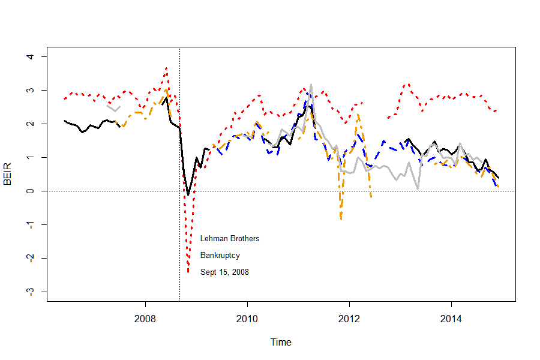

##  **MTS_BEIR**


```yaml
Name of QuantLet : Modeling of Term Structure for Inflation Estimation

Published in : 'Unpublished; Observed BEIR rates for each country - 
U.K., Germany, France, Italy and Sweden: Shi Chen - Inflation 
Co-movement across Countries in a Multi-maturity Term Structure: 
An Arbitrage-Free Approach'

Description : 'Plots the breakeven inflation rate (BEIR)across five 
different industrialized European countries - U.K., Germany, France, 
Italy and Sweden.'

Keywords : 'bond, graphical representation, plot, time-series, 
visualization'

See also : 'MTS_afns_de, MTS_afns_fr, MTS_afns_uk, MTS_afns_it, MTS_afns_sw'

Author : Shi Chen

Submitted :

Datafile : 'deinf.csv, denom.csv, fr_inf.csv, fr_nom.csv, italy_inf.csv, 
italy_nom.csv, sweden_inf.csv, sweden_nom.csv, ukspot_nom.csv, ukspot_real.csv'

Example :

```



```R
## clear history
rm(list = ls(all = TRUE))
graphics.off()

## install and load packages
libraries = c("zoo")
lapply(libraries, function(x) if (!(x %in% installed.packages())) {
  install.packages(x)
})
lapply(libraries, library, quietly = TRUE, character.only = TRUE)

setwd("")

## read data of U.K.
ukdata1 = read.csv("ukspot_nom.csv", header = F, sep = ";")  #U.K. nominal bonds
ukdate = as.character(ukdata1[, 1])
st = which(ukdate == "30 Jun 06")
et = which(ukdate == "31 Dez 14")
ukdata11 = ukdata1[(st:et), 3:51]

ukdata2 = read.csv("ukspot_real.csv", header = F, sep = ";")  #U.K. inflation-indexed bonds
ukdate = as.character(ukdata2[, 1])
st = which(ukdate == "30 Jun 06")
et = which(ukdate == "31 Dez 14")
ukdata22 = ukdata2[(st:et), 2:47]
uknom = cbind(ukdata11[, 5], ukdata11[, 7], ukdata11[, 9])
ukinf = cbind(ukdata22[, 2], ukdata22[, 4], ukdata22[, 6])
ukmat = c(3, 4, 5)

ukjoi = cbind(uknom[, 1], ukinf[, 1])
for (i in 2:length(ukmat)) {
  ukjoi = cbind(ukjoi, uknom[, i], ukinf[, i])
}


ukbei = uknom - ukinf  #mat: 3,4,5
ts.ukbeipre = ts(ukbei[, 1], frequency = 12, start = c(2006, 6))

## read data of Germany
dedata1 = read.csv("denom.csv", header = F, sep = ";")
dedate = as.character(dedata1[, 1])
st = which(dedate == "30.06.2009")
et = which(dedate == "31.12.2014")
dedata11 = dedata1[(st:et), 2:14]

dedata2 = read.csv("deinf.csv", header = F, sep = ";")
dedate = as.character(dedata2[, 2])
st = which(dedate == "30.06.2009")
et = which(dedate == "31.12.2014")
dedata22 = dedata2[(st:et), 3:5]

denom = cbind(dedata11[, 4], dedata11[, 6], dedata11[, 9])
deinf = cbind(dedata22[, 1], dedata22[, 2], dedata22[, 3])
demat = c(5, 7, 10)

dejoi = cbind(denom[, 1], deinf[, 1])
for (i in 2:length(demat)) {
  dejoi = cbind(dejoi, denom[, i], deinf[, i])
}

debei = denom - deinf
ts.debeipre = ts(debei[, 1], frequency = 12, start = c(2009, 6))

## read data of France
frdata1 = read.csv("frnom2.csv", header = F, sep = ";")
frdate = as.character(frdata1[, 2])
st = which(frdate == "30.06.2006")
et = which(frdate == "31.12.2014")
frdata11 = frdata1[(st:et), 3:14]

frdata2 = read.csv("frinf_bloom.csv", header = F, sep = ";")
frdate = as.character(frdata2[, 1])
st = which(frdate == "30.06.2006")
et = which(frdate == "31.12.2014")
frdata22 = frdata2[(st:et), 2:9]

frnom = cbind(frdata11[, 2], frdata11[, 4], frdata11[, 9])
frinf = cbind(frdata22[, 2], frdata22[, 4], frdata22[, 5])
frmat = c(3, 5, 10)

frjoi = cbind(frnom[, 1], frinf[, 1])
for (i in 2:length(frmat)) {
  frjoi = cbind(frjoi, frnom[, i], frinf[, i])
}

frbei = frnom - frinf
ts.frbeipre = ts(frbei[, 1], frequency = 12, start = c(2006, 6))

## read data of Italy
itdata1 = read.csv("itnom.csv", header = F, sep = ";")
itdate = as.character(itdata1[, 1])
st = which(itdate == "30.06.2006")
st = which(itdate == "29.06.2007")
et = which(itdate == "31.12.2014")
itdata11 = itdata1[(st:et), 2:12]

itdata2 = read.csv("itinf2.csv", header = F, sep = ";")
itdate = as.character(itdata2[, 1])
st = which(itdate == "29.06.2007")
et = which(itdate == "31.12.2014")
itdata22 = itdata2[(st:et), 2:8]

itnom = cbind(itdata11[, 2], itdata11[, 4], itdata11[, 9])
itinf = cbind(itdata22[, 3], itdata22[, 4], itdata22[, 6])
itmat = c(3, 5, 10)

itjoi = cbind(itnom[, 1], itinf[, 1])
for (i in 2:length(itmat)) {
  itjoi = cbind(itjoi, itnom[, i], itinf[, i])
}

itbei = itnom - itinf
ts.itbeipre = ts(itbei[, 1], frequency = 12, start = c(2007, 6))

## read data of Sweden
swdata1 = read.csv("swnom.csv", header = F, sep = ";")
swdate = as.character(swdata1[, 1])
st = which(swdate == "30.04.2007")
et = which(swdate == "29.08.2014")
swdata11 = swdata1[(st:et), 2:8]

swdata2 = read.csv("swinf3.csv", header = F, sep = ";")
swdate = as.character(swdata2[, 1])
st = which(swdate == "30.04.2007")
et = which(swdate == "29.08.2014")
swdata22 = swdata2[(st:et), 2:6]

swnom = cbind(swdata11[, 1], swdata11[, 4], swdata11[, 5])
swinf = cbind(swdata22[, 1], swdata22[, 2], swdata22[, 3])
swmat = c(2, 5, 7)

swjoi = cbind(swnom[, 1], swinf[, 1])
for (i in 2:length(swmat)) {
  swjoi = cbind(swjoi, swnom[, i], swinf[, i])
}
swbei = swnom - swinf
ts.swbeipre = ts(swbei[, 1], frequency = 12, start = c(2007, 4))

## BEIR plot
par(mfrow = c(1, 1), pty = "m")
plot(ts.ukbeipre, lty = 3, lwd = 3, col = "red", ylim = c(-3, 4), ylab = "BEIR")
lines(ts.debeipre, lty = 2, col = "blue", lwd = 3)
lines(ts.frbeipre, lty = 1, col = "black", lwd = 3)
lines(ts.itbeipre, lty = 4, col = "orange2", lwd = 3)
lines(ts.swbeipre, lty = 1, col = "grey", lwd = 3)
abline(h = 0, lty = "dotted", col = "gray3")
abline(v = time(ts.ukbeipre)[28], lty = "dotted", col = "gray3")
text(time(ts.ukbeipre)[33], -1.5, "Lehman Brothers", col = "gray3", 
     adj = c(0, -0.1), cex = 0.8)
text(time(ts.ukbeipre)[33], -2, "Bankruptcy", col = "gray3", 
     adj = c(0, -0.1), cex = 0.8)
text(time(ts.ukbeipre)[33], -2.5, "Sept 15, 2008", col = "gray3", 
     adj = c(0, -0.1), cex = 0.8)
```
