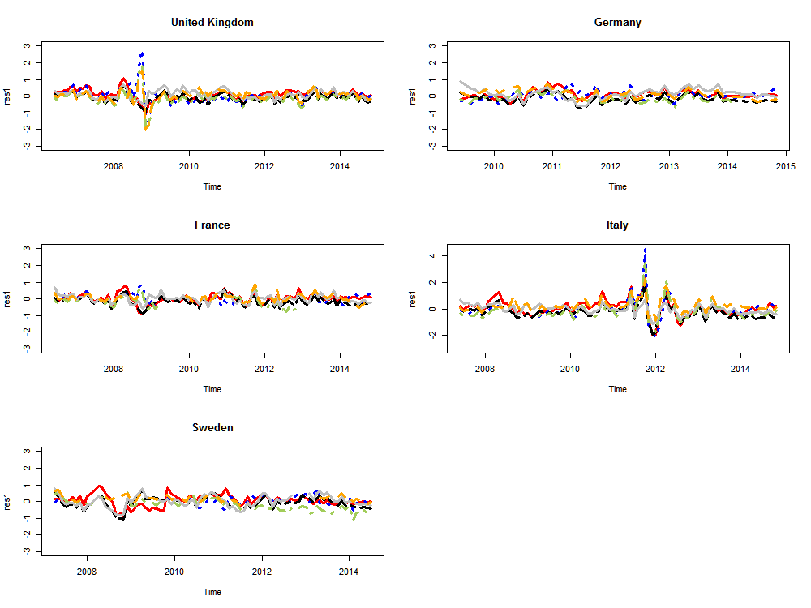

[](http://quantlet.de/)

## [](http://quantlet.de/) **MTS_multi_modelres** [](http://quantlet.de/)

```yaml

Name of QuantLet : MTS_multi_modelres

Published in : MTS

Description : 'Plots the model residuals estimated from AFNS model in a multi-maturity term
structue for all the five sample countries.'

Keywords : bond, error, estimation, graphical representation, plot, returns

See also : 'MTS_afns_de, MTS_afns_fr, MTS_afns_it, MTS_afns_sw, MTS_afns_uk, MTS_comexpinf_cds,
MTS_comexpinf, MTS_expinf'

Author : Shi Chen

Datafile : 'joide0915ans.RData, joifr0915ans.RData, joiit0715ans.RData, joisw0714ans.RData,
joiuk0915ans.RData'

Example : 'The model residuals for nominal and inflation-linked bonds estimated from multiple yield
curve modeling over three different maturities.'

```




### R Code:
```r
# ------------------------------------------------------------------------------
# Project:     MTS - Modeling of Term Structure for Inflation Estimation
# ------------------------------------------------------------------------------
# Quantlet:    MTS_modelres
# ------------------------------------------------------------------------------
# Description: Plots the model residuals of AFNS model
#              multi-maturity term structue. Graphic showing the filtered
#              and predicted state variables.
# ------------------------------------------------------------------------------
# Keywords:    plot, error, graphical representation, estimation, bond
#              returns, log-returns
# ------------------------------------------------------------------------------
# See also:    
# ------------------------------------------------------------------------------
# Author:      Shi Chen
# ------------------------------------------------------------------------------

## clear history
rm(list = ls(all = TRUE))
graphics.off()

## install and load packages
libraries = c("zoo")
lapply(libraries, function(x) if (!(x %in% installed.packages())) {
  install.packages(x)
})
lapply(libraries, library, quietly = TRUE, character.only = TRUE)

par(mfrow = c(3, 2), pty = "m")
## For UK
load("joiuk0915ans.RData")
ans = joiuk0915ans
res1 = ts(ans$vt[1, -1], frequency = 12, start = c(2006, 6))
res2 = ts(ans$vt[2, -1], frequency = 12, start = c(2006, 6))
res3 = ts(ans$vt[3, -1], frequency = 12, start = c(2006, 6))
res4 = ts(ans$vt[4, -1], frequency = 12, start = c(2006, 6))
res5 = ts(ans$vt[5, -1], frequency = 12, start = c(2006, 6))
res6 = ts(ans$vt[6, -1], frequency = 12, start = c(2006, 6))

plot(res1, lty = 1, lwd = 3, col = "red", ylim = c(-3, 3), main = "United Kingdom")
lines(res2, lty = 3, col = "blue", lwd = 3)
lines(res3, lty = 6, col = "black", lwd = 3)
lines(res4, lty = 4, col = "darkolivegreen3", lwd = 3)
lines(res5, lty = 1, col = "grey", lwd = 3)
lines(res6, lty = 2, col = "orange", lwd = 3)

## For Germany
load("joide0915ans.RData")
ans = joide0915ans
res1 = ts(ans$vt[1, -1], frequency = 12, start = c(2009, 6))
res2 = ts(ans$vt[2, -1], frequency = 12, start = c(2009, 6))
res3 = ts(ans$vt[3, -1], frequency = 12, start = c(2009, 6))
res4 = ts(ans$vt[4, -1], frequency = 12, start = c(2009, 6))
res5 = ts(ans$vt[5, -1], frequency = 12, start = c(2009, 6))
res6 = ts(ans$vt[6, -1], frequency = 12, start = c(2009, 6))

plot(res1, lty = 1, lwd = 3, col = "red", ylim = c(-3, 3), main = "Germany")
lines(res2, lty = 3, col = "blue", lwd = 3)
lines(res3, lty = 6, col = "black", lwd = 3)
lines(res4, lty = 4, col = "darkolivegreen3", lwd = 3)
lines(res5, lty = 1, col = "grey", lwd = 3)
lines(res6, lty = 2, col = "orange", lwd = 3)


## For France
load("joifr0915ans.RData")
ans = joifr0915ans

res1 = ts(ans$vt[1, -1], frequency = 12, start = c(2006, 6))
res2 = ts(ans$vt[2, -1], frequency = 12, start = c(2006, 6))
res3 = ts(ans$vt[3, -1], frequency = 12, start = c(2006, 6))
res4 = ts(ans$vt[4, -1], frequency = 12, start = c(2006, 6))
res5 = ts(ans$vt[5, -1], frequency = 12, start = c(2006, 6))
res6 = ts(ans$vt[6, -1], frequency = 12, start = c(2006, 6))

plot(res1, lty = 1, lwd = 3, col = "red", ylim = c(-3, 3), main = "France")
lines(res2, lty = 3, col = "blue", lwd = 3)
lines(res3, lty = 6, col = "black", lwd = 3)
lines(res4, lty = 4, col = "darkolivegreen3", lwd = 3)
lines(res5, lty = 1, col = "grey", lwd = 3)
lines(res6, lty = 2, col = "orange", lwd = 3)

### For Italy
load("joiit0715ans.RData")
ans = joiit0715ans

res1 = ts(ans$vt[1, -1], frequency = 12, start = c(2007, 6))
res2 = ts(ans$vt[2, -1], frequency = 12, start = c(2007, 6))
res3 = ts(ans$vt[3, -1], frequency = 12, start = c(2007, 6))
res4 = ts(ans$vt[4, -1], frequency = 12, start = c(2007, 6))
res5 = ts(ans$vt[5, -1], frequency = 12, start = c(2007, 6))
res6 = ts(ans$vt[6, -1], frequency = 12, start = c(2007, 6))

plot(res1, lty = 1, lwd = 3, col = "red", ylim = c(-3, 4.5), main = "Italy")
lines(res2, lty = 3, col = "blue", lwd = 3)
lines(res3, lty = 6, col = "black", lwd = 3)
lines(res4, lty = 4, col = "darkolivegreen3", lwd = 3)
lines(res5, lty = 1, col = "grey", lwd = 3)
lines(res6, lty = 2, col = "orange", lwd = 3)

## For Sweden
load("joisw0714ans.RData")
ans = joisw0714ans
res1 = ts(ans$vt[1, -1], frequency = 12, start = c(2007, 4))
res2 = ts(ans$vt[2, -1], frequency = 12, start = c(2007, 4))
res3 = ts(ans$vt[3, -1], frequency = 12, start = c(2007, 4))
res4 = ts(ans$vt[4, -1], frequency = 12, start = c(2007, 4))
res5 = ts(ans$vt[5, -1], frequency = 12, start = c(2007, 4))
res6 = ts(ans$vt[6, -1], frequency = 12, start = c(2007, 4))

plot(res1, lty = 1, lwd = 3, col = "red", ylim = c(-3, 3), main = "Sweden")
lines(res2, lty = 3, col = "blue", lwd = 3)
lines(res3, lty = 6, col = "black", lwd = 3)
lines(res4, lty = 4, col = "darkolivegreen3", lwd = 3)
lines(res5, lty = 1, col = "grey", lwd = 3)
lines(res6, lty = 2, col = "orange", lwd = 3)


```
